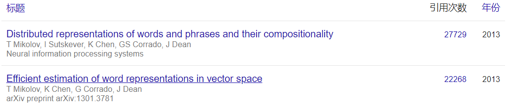
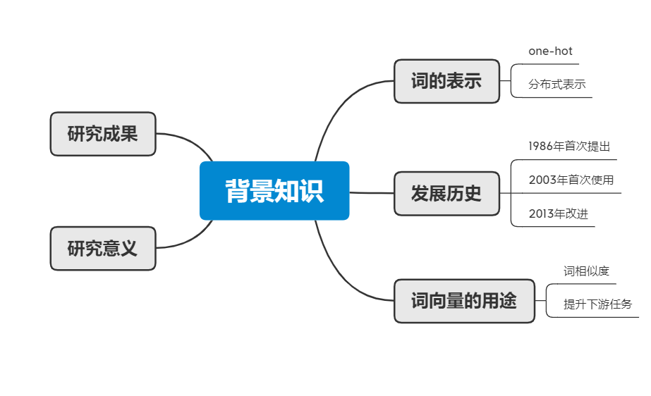
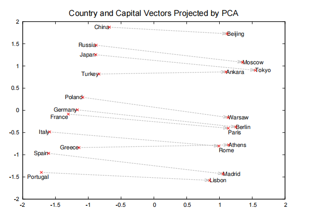
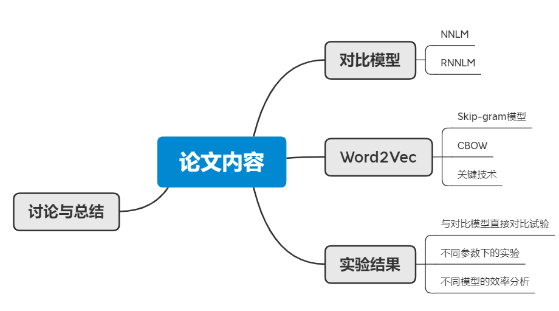
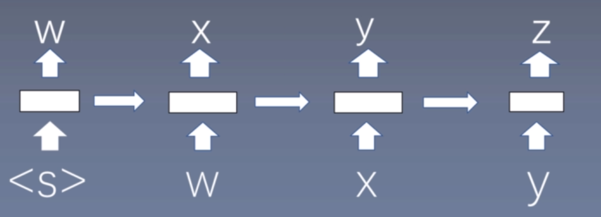
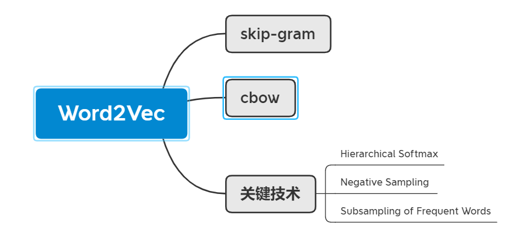
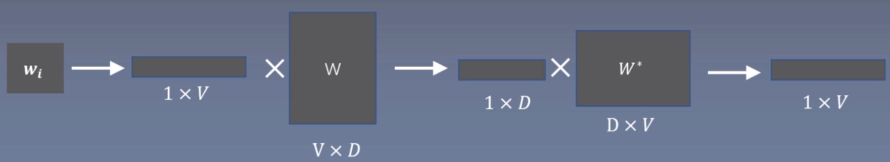

# 《Efficient Estimation of  Word Representations in Vector Space》

***基于向量空间中词表示的有效估计***

关联论文：**《Distributed Representations of Words and Phrases and their Compositionality》**【单词和短语的分布式表示及其组成】引用量：27729

作者：Tomas Mikolov

单位：Google

conference：ICLR 2013

引用：22268

## 语言模型

语言模型是计算一个**句子是句子**的概率的模型（是否合乎语义和语法）

**举例**：

​        小明是个好人    ——0.8（因为根据数据分析，小明和好人的关联程度较高）

​        小明是个坏人    ——0.1（小明和坏人的关联程度较低）

​        好人是个小明    ——0.0001 （不符合语法规则）    

**1.基于专家语法规则的语言模型（比如形容词后面接名词等）**

缺点：语言是变化的，很难总结出一套通用的语法规则；

​            随着时代的变化会有一些新词出来，比如：笑skr人等；

**2.统计语言模型（通过概率来刻画语言模型）**  

​                            $P(s)=P(w_1,w_2,...w_n)=P(w_1)P(w_2|w_1)P(w_3|w_1w_2)...P(w_n|w_1w_2...w_{n-1})$

**求解方法**：用语料的频率代替概率（频率学派）

​                                                                  $p(w_i)=\frac{count(w_i)}{N}$

​                                                           $p(w_i|w_{i-1})=\frac{count(w_{i-1},w_i)}{count(w_{i-1})}$

***这种统计语言模型存在的问题：对于在语料库中不存在的词其概率为0***

​                                             **解决方式**：**统计语言模型中的平滑操作**

​        有一些词或者词语在语料中没有出现过，但是这不能代表它不存在，平滑操作就是**给那些没有出现过的词或者词组也给一个比较小的概率**

==<u>**laplace smoothing**：加1平滑——每个词在原来出现次数的基础上加1</u>==

> 举例：
> A:出现0次        P(A)=0/1000=0     >>laplace smoothing>>      A:出现1次    P(A)=1/1003=0.001
> B:出现990次    P(B)=990/1000=0.99   >>laplace smoothing>>    B:出现991次    P(B)=991/1003=0.988
> C:出现10次    P(B)=10/1000=0.01   >>laplace smoothing>>    C:出现11次    P(C)=11/1003=0.011
>
> 可以发现经过laplace smoothing 概率大的变小，概率小的变大——劫富济贫思想                            

**Laplace平滑操作的问题：参数空间过大，数据稀疏严重**

马尔可夫假设  

- unigram   $P(s)=P(w_1)P(w_2)P(w_3)...P(w_n)$
- bigram    $P(s)=P(w_1)P(w_2|w_1)P(w_3|w_2)...P(w_n|w_{n-1})$
- trigram    $P(s)=P(w_1)P(w_2|w_1)P(w_3|w_1w_2)...P(w_n|w_{n-2}w_{n-1})$
- k-gram(依赖于前面k-1个词)                $P(s)=P(w_1,w_2,...w_n)=P(w_1)P(w_2|w_1)P(w_3|w_1w_2)...P(w_n|w_{n-k+1}...w_{n-1})$

**3.语言模型评价指标：困惑度（Perplexity）**

语言模型本质上是一个**多分类问题**

$PP(s)=P(w_1,w_2,...,w_n)^{-\frac{1}{n}}=\sqrt[n]{\frac{1}{P(w_1,w_2,...,w_n)}}$

句子概率越大，语言模型越好，困惑度越小

## 背景知识

### 词的表示方法（word representation）

**1.one-hot representation**

优点：表示简单

缺点：词越多，维数越高；无法表示词和词之间的关系

**2.window based co-occurence matrix**（基于窗口的共现矩阵）

需要svd对矩阵进行降维

获取对角矩阵，对角线上特征值越大，特征向量越重要 ，若是对角矩阵中后面的特征值过小就舍去，保留前k个中要的特征向量

优点：可以一定程度上得到词与词之间的相似度

缺点：矩阵太大，svd矩阵分解效率低，学习得到的词向量可解释性差

**3.distributed representation**

分布式表示/稠密表示

把10000dim的向量压缩至200dim，可以表示词和词之间的关系——word embedding

### 研究成果

- 提出新的模型
- 提出优化训练的方法，是的训练速度加快
- 给出训练代码word2vec，使得单机训练称为可能
- 成果：训练的词向量，又快又好，并且能在大规模预料上进行词向量的训练

### 研究意义

衡量词之间的相似程度 

作为预训练模型提升nlp任务

## 论文内容

Abstract：提出两种新的高效计算词向量结构，并使用词相似度任务验证效果

Introduction：介绍词向量背景；本文目标；前人工作

Model Architectures：LSA/LDA；前向神经网络；RNN；并行网络计算

Example of the Learned Relationships：例子：学习到的词与词之间的关系

Results：评价任务描述；最大化正确率；模型结构比较；模型上大量数据并行计算；完成MicroSoft句子比赛

New Log-linear Models：介绍2种新模型结构：CBOW，Skip-grams

Conclusion：高质量词向量；高效率训练方式；作为预训练词向量作用于其他nlp任务能提升效果

##  摘要核心

1.提出了两种新颖的模型结构用来计算词向量

2.采用一种词相似度的任务来评估对比词向量质量

3.大量降低模型计算量可以替身词向量的质量

4.进一步，在我们的语义和句法任务上，我们的词向量是当前的最好的效果

## Introduciton

- 传统NLP把词当成最小单元处理，并且能够大语料上得到很好的结果，其中一个例子是N-grams
- 然而很多NLP任务只能提供很小的语料，如语音识别、机器翻译，所以简单地扩大数据规模来提升简单模型的表现在这些任务不再适用，我们希望即使训练较小的语料也能够有很好的表现，所以我们必须寻找更加先进的模型
- 分布式表示是可以在大语料上训练得到很好效果的语言模型，性能超过N-grams模型

### word2vec评价方法

#### 内部任务评价

- 衡量词向量之间的相似程度
- **词类比ananlogy**
- 

#### 外部任务评价

实体识别、文本分类

## 论文模型内容

#### 对比模型

##### 前馈神经网络语言模型（NNLM）【全连接的神经网络】

根据前n-1个单词，预测第n个位置单词的概率——n-grams模型【语言模型是**无监督的**，不需要标注语料，理由就是这个，相当于前n-1个单词作为训练集，预测第n个单词】，如果是第一个单词，则在第一个词之前pad（填充）一下，pad前n-1个数值为0 

优化模型，使得输出的正确的单词概率最大化

图中从下至上依次为input layer、hidden layer 、output layer

**input layer：**将词映射为向量，相当于一个1*V的one-hot向量乘以一个V *D的矩阵得到一个1 *D的向量

**这里V*D的矩阵是随机初始化的矩阵可以是小数，也可以是整数，没有任何规定** 

 **hidden layer：**一个以tanh为激活函数的全连接层：a=tanh(d+Ux)

**output layer：**一个全连接层，后面接一个softmax函数生成概率分布  

###### y=b+Wa【还没归一化】，其中y是一个1*V的向量，再用softmax归一化。

softmax：$P(w_t|w_{t-n+1},...,w_{t-1})=\frac{exp(y_{w_t})}{\sum_{i}exp(y_{w_i})}$

###### 语言模型困惑度和Loss的关系

**这里loss用的是多分类交叉熵损失函数**

$Loss: L=-\frac{1}{T}\sum_{i=1}^{T}logP(w_i|w_i-n+1,...,w_{i-1})$

$PP(s)=P(w_1,w_2,...,w_n)^{-\frac{1}{T}}=\sqrt[T]{\frac{1}{P(w1,w2,...,w_T)}}$

$log(PP(s))=-\frac{1}{T}log(P(w_1)P(w_2|w_1)...P(w_T|w_{T-n+1},...,w_{T-1}))$

$log(PP(s))=-\frac{1}{T}\{log(P(w_1)+log(P(w_2|w_1))+...+log(P(w_T|w_{T-n+1},...,w_{T-1}))\}$

$log(PP(s))=-\frac{1}{T} \sum_{i=1}^{T}logP(w_i|w_{i-n+1},...,w_{i-1}))$

$PP(s)=e^L$

得到loss，就可以推出困惑度

$T:词的个数$

###### 可改进的点

- 仅对一部分输出进行梯度传播（对于一些冠词：the，a等无意义但又频繁出现的单词可以不进行训练）
- 引入先验知识，如词性等（网络是否可以自主训练数据标注词性？可以）
- 解决一词多义问题（根据上下文）
- 加速softmax层

##### 循环神经网络语言模型（RNNLM）

 input layer：和NNLM一样，需要将当前时间步的转化为词向量

hidden layer：对输入和上一个时间步的隐藏输出进行全连接层操作

$s(t)=Uw(t)+Ws(t-1)+d$

output layer：一个全连接层，后面接一个softmax函数来生成概率分布$y(t)=b+Vs(t)$,
其中y是一个1*V的向量：$P(w_t|w_{t-n+1},...,w_{t-1})=\frac{exp(y_{w_t})}{\sum_iexp(y_i)}$

每个时间步预测一个词，在预测第n个词时使用了前n-1个词的信息

#### Word2Vec

##### log-linear model

def：将语言模型的建立看成一个多分类问题，相当于线性分类器加上softmax[多分类的逻辑回归模型]

$Y=softmax(wx+b)$

##### word2vec原理

- **语言模型基本思想**：句子中的下一个词语的出现和前面的词是有关系的，所以可以使用前面的词预测下一个词
- **word2vec基本思想**：句子中相近的词之间是有联系的【不同于一般的语言模型思想，只要距离够近】，比如”今天“后面常出现“上午”，“下午”和“晚上”，反之三者后面也可能会接“今天”。所以word2vec的基本思想即使用词频来预测词，**skip-gram使用中心词预测周围词，cbow使用周围词预测中心词**

$w_i是index向量，然后再转化成one-hot的1 \times V的向量，V \times D为初始化的distributed embedding的参数矩阵W$

$与W做内积得到1 \times D的embedding，此向量为index对应的embedding表示，再与W的转置W^T做内积，得到一个1 \times V的向量，$

$P(w_{i-1}|w_i)=\frac{exp(u_{w_{i-1}}^Tv_{w_i})}{\sum_{w=1}^{V}exp(u_w^{T}v_{w_i})}$

$其中u_{w_{i-1}表示}$

